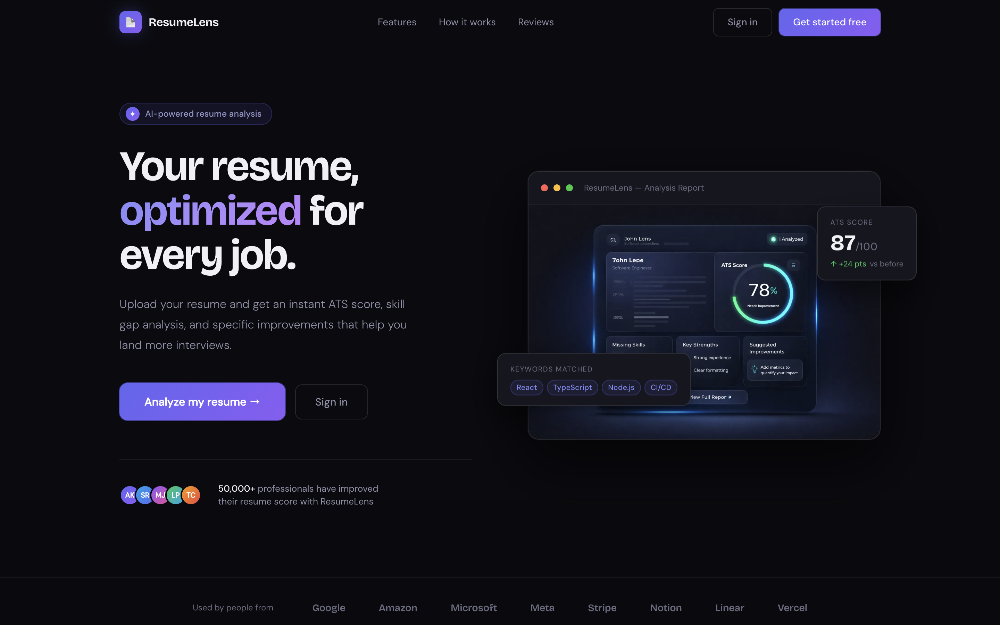
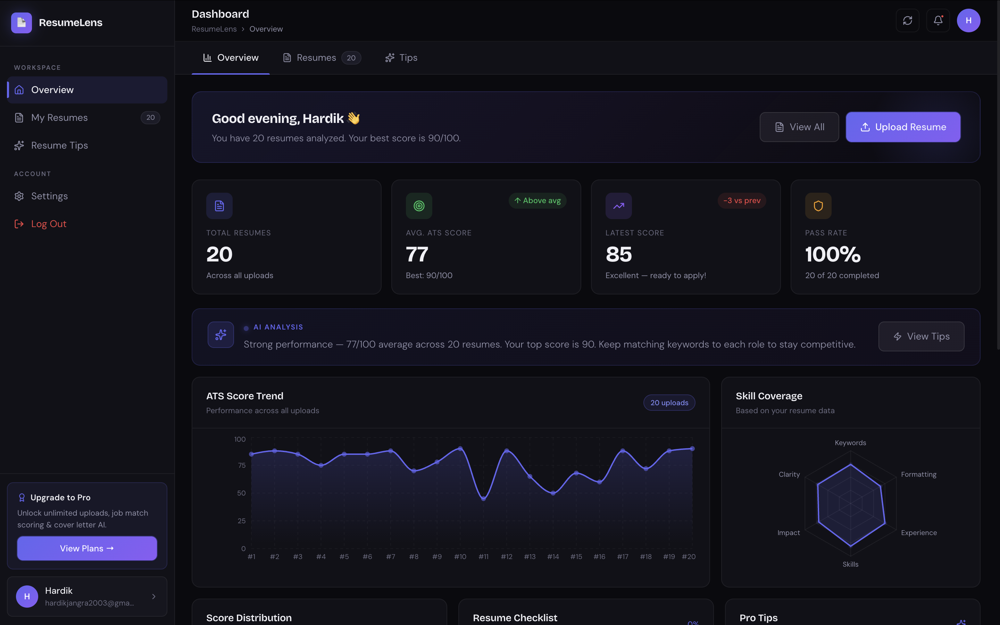
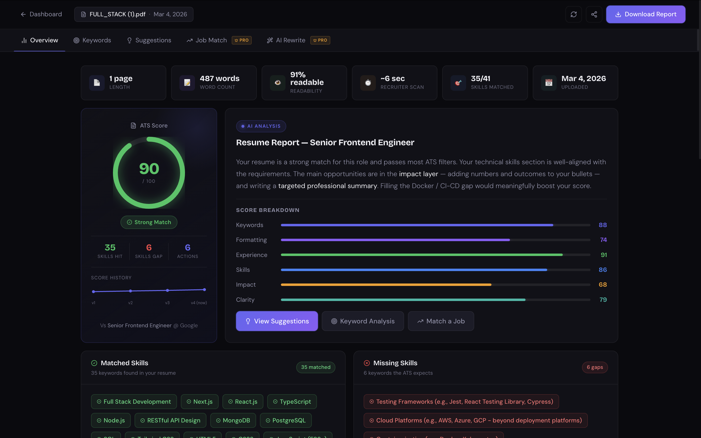
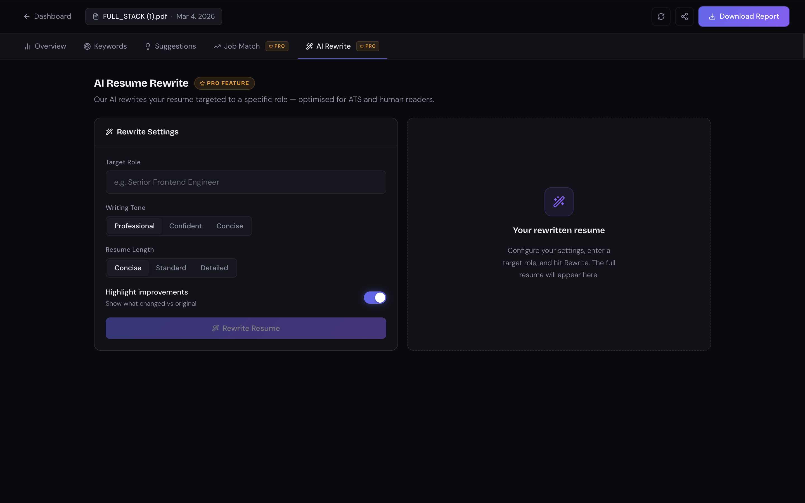

ResumeLens AI 📄🤖

ResumeLens AI is an AI-powered resume optimization platform that analyzes resumes, provides ATS compatibility scores, highlights strengths and weaknesses, and helps users rewrite resumes tailored for specific job roles.

🚀 Overview

ResumeLens AI helps job seekers improve their resumes by simulating how an Applicant Tracking System (ATS) evaluates them.
The platform provides detailed resume analysis, AI-powered rewriting suggestions, and job-description compatibility scoring to help candidates maximize their chances of passing recruiter screening systems.

⚡ Workflow

1️⃣ User uploads their resume

2️⃣ The system analyzes the resume and generates an ATS compatibility score

3️⃣ The platform highlights resume strengths and weaknesses

4️⃣ Users can rewrite their resume using AI for a specific job role

5️⃣ Users can paste a job description to evaluate compatibility

6️⃣ The system calculates how well the resume matches the job description

🛠 Tech Stack

Frontend

Next.js

React

TypeScript

Tailwind CSS

Backend / AI Integration

Node.js

LLM APIs

Resume parsing & text analysis

✨ Features

Resume upload and parsing

ATS score evaluation

Strength and weakness analysis

AI-powered resume rewriting

Job description compatibility checker

Clean and responsive UI

## 📸 Screenshots

### Landing Page

### ATS Score Dashboard

### Resume Analysis

### AI Resume Rewrite

